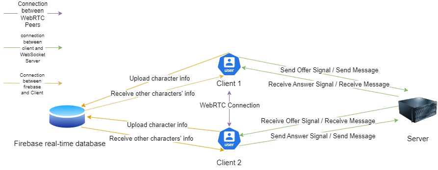

<a name="readme-top"></a>

<!-- PROJECT LOGO -->
<div align="center">


<h3 align="center">Virtual Office Web App</h3>
  <p align="center">
    With the population of working from home, remote meeting is becoming necessary. However, the traditional remote meeting doesn't offer an in-office feeling because they only have video calls and lack a virtual office environment. Virtual Office Web App offers a brand new remote meeting way by creating a character for everyone in the meeting and they can see each other as if working in office but in a remote virtual environment.
  </p>
</div>


<!-- TABLE OF CONTENTS -->
<details>
  <summary>Table of Contents</summary>
  <ol>
    <li>
      <a href="#about-the-project">About The Project</a>
      <ul>
        <li><a href="#built-with">Built With</a></li>
      </ul>
      <ul>
        <li><a href="#architecture">Architecture</a></li>
      </ul>
    </li>
    <li>
      <a href="#getting-started">Getting Started</a>
      <ul>
        <li><a href="#prerequisites">Prerequisites</a></li>
        <li><a href="#installation">Installation</a></li>
      </ul>
    </li>
  </ol>
</details>


<!-- ABOUT THE PROJECT -->
## About The Project

![Screen Shot][product-screenshot]

<p align="right">(<a href="#readme-top">back to top</a>)</p>


### Built With

* [![JavaScript][JavaScript-shield]][JavaScript-url]
* [![Node_js][Node_js-shield]][Node_js-url]
* [![React][React.js]][React-url]
* [![React_Redux][React_Redux-shield]][React_Redux-url]
* [![Firebase][Firebase-shield]][Firebase-url]
* [![Chakra_UI][Chakra_UI-shield]][Chakra_UI-url]
* [![Socket_IO][Socket_IO-shield]][Socket_IO-url]
* [![Peer_JS][Peer_JS-shield]][Peer_JS-url]

<p align="right">(<a href="#readme-top">back to top</a>)</p>


### Architecture

* 
* 

<p align="right">(<a href="#readme-top">back to top</a>)</p>


<!-- GETTING STARTED -->
## Getting Started

This is an example of how you may give instructions on setting up your project locally.
To get a local copy up and running follow these simple example steps.

### Prerequisites
* Node.js
* npm
* Broswer

### Installation

1. Install NPM packages And start backend server
   ```sh
   cd server && npm install && node index.js
   ```
2. Install NPM packages And start frontend
   ```sh
   cd ../client && npm install && npm run-script build && npx serve -s build
   ```
3. Open a browser window and go to http://localhost:3000/

<p align="right">(<a href="#readme-top">back to top</a>)</p>


<!-- MARKDOWN LINKS & IMAGES -->
[product-screenshot]: images/screenshot.png
[React.js]: https://img.shields.io/badge/React-20232A?style=for-the-badge&logo=react&logoColor=61DAFB
[React-url]: https://reactjs.org/
[JavaScript-shield]: https://img.shields.io/badge/javascript-%23323330.svg?style=for-the-badge&logo=javascript&logoColor=%23F7DF1E
[JavaScript-url]: https://www.javascript.com/
[React_Redux-shield]: https://img.shields.io/badge/redux-%23593d88.svg?style=for-the-badge&logo=redux&logoColor=white
[React_Redux-url]: https://react-redux.js.org/
[Firebase-shield]: https://img.shields.io/badge/firebase-a08021?style=for-the-badge&logo=firebase&logoColor=ffcd34
[Firebase-url]: https://firebase.google.com/
[Node_js-shield]: https://img.shields.io/badge/node.js-6DA55F?style=for-the-badge&logo=node.js&logoColor=white
[Node_js-url]: https://nodejs.org/
[Chakra_UI-shield]: https://img.shields.io/badge/chakra-%234ED1C5.svg?style=for-the-badge&logo=chakraui&logoColor=white
[Chakra_UI-url]: https://v2.chakra-ui.com/
[Socket_IO-shield]: https://img.shields.io/badge/Socket.io-black?style=for-the-badge&logo=socket.io&badgeColor=010101
[Socket_IO-url]: https://socket.io/
[Peer_JS-shield]: https://img.shields.io/badge/peerjs-black?style=for-the-badge&logo=peerjs&badgeColor=010101
[Peer_JS-url]: https://peerjs.com/
